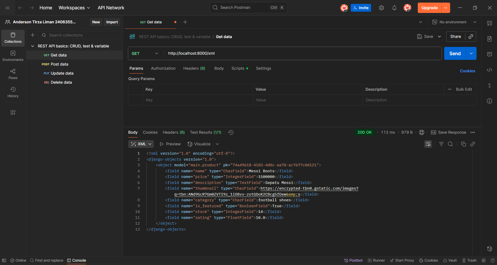
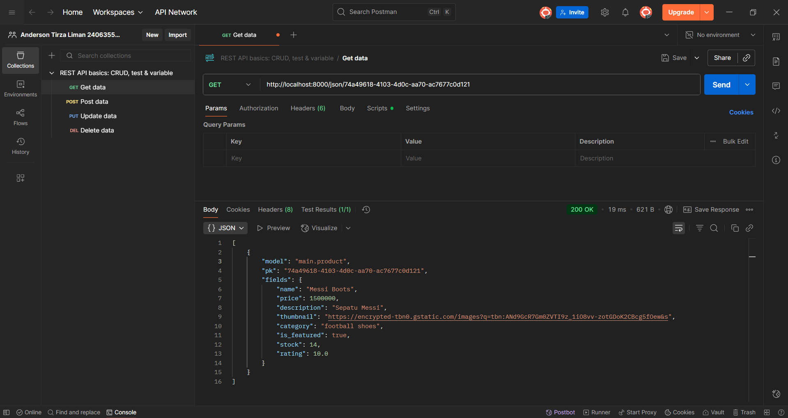

# Tugas 3
# eFootball-shop

Nama : Anderson Tirza Liman

NPM : 2406355893

Kelas : PBP B

Tautan: https://anderson-tirza-efootballshop.pbp.cs.ui.ac.id/

1.  Jelaskan mengapa kita memerlukan data delivery dalam pengimplementasian sebuah platform?
Data delivery adalah sebuah proses pengiriman data di antara berbagai komponen dalam sebuah platform. Data delivery diperlukan karena beberapa hal, antara lain:
a. Komunikasi, agar platform dapat fungsional melalui data yang dikirim dari pengguna ke sistem. Platform tidak berguna tanpa kehadiran data yang dapat di-input maupun dari yang di-output.
b. Sinkronisasi, yakni memastikan data tetap menjaga konsistensinya pada bagian-bagian platform.
c. Integrasi, agar memungkinkan sistem berinteraksi dengan banyak layanan lain, misalnya API pembayaran.
d. User experience, karena tanpa data delivery, user tidak akan dapat memperoleh informasi secara real-time (misalnya notifikasi).

Data delivery sangat diperlukan agar sebuah platform dapat bekerja secara fungsional, interaktif, dan dinamis.

2. Menurutmu, mana yang lebih baik antara XML dan JSON? Mengapa JSON lebih populer dibandingkan XML?
Keduanya memiliki kelebihannya masing-masing. XML sendiri lebih kuat untuk data dengan struktur yang cukup rumit, mendukung skema validasi, namespace, dan metadata. Sementara itu, JSON sendiri lebih ringan, lebih human-readable, lebih cepat diproses oleh browser/JavaScript karena langsung bisa dipetakan ke objek.

JSON lebih populer dibandingkan XML karena beberapa hal, antara lain:
a. Sintaks lebih sederhana, ringkas, dan mudah dibaca
b. Lebih efisien untuk transmisi data jarena umumnya file JSON berukuran lebih kecil.
c. Dapat terintegrasi langsung dengan JavaScript.
d. Lebih cepat diproses pada modern API web (pada sebagian besar REST API menggunakan JSON).

3. Jelaskan fungsi dari method is_valid() pada form Django dan mengapa kita membutuhkan method tersebut?
Fungsi dari form.is_valid() adalah memvalidasi data yang diinput serta dikirim user melalui form berdasarkan aturan-aturan yang telah didefinisikan oleh pengembang di Django Form (sebagai contoh, field type, panjang maksimal, required field, dan lain-lain).

form.is_valid() akan mengembalikan True jika input valid, kemudian data yang sudah dibersihkan dapat diakses melalui form.cleaned_data. Sebaliknya, jika tidak valid, form.is_valid() mengembalikan False, dan secara otomatis Django akan menyediakan pesan error yang bisa ditampilkan kepada user.

Method tersebut dibutuhkan sebagai upaya pencegahan wrong input/dangerous input. Wrong input misalnya seperti email tidak valid, password yang kosong. Dangerous input seperti SQL injection. Semua ini ditujukan untuk menghindari kerusakan data di database akibat input tidak sesuai format (input yang tidak valid).

4. Mengapa kita membutuhkan csrf_token saat membuat form di Django? Apa yang dapat terjadi jika kita tidak menambahkan csrf_token pada form Django? Bagaimana hal tersebut dapat dimanfaatkan oleh penyerang?
CSRF (Cross-Site Request Forgery) adalah sebuah serangan ketika penyerang memanipulasi user agar tanpa sadar mengirimkan request ke website yang sudah terautentikasi. Penyerang dapat melegitimasi transfer uang, mengubah password, dan lain-lain.

Dalam sistem Django, ditambahkan sebuah mekanisme pertahanan, yakni csrf_token. Hal tersebut ditujukan untuk memastikan bahwa request benar-benar berasal dari halaman asli aplikasi milik kita sendiri, bukan dari website berbahaya.

Ada resiko dan konsekuensi apabila tidak menambahkan csrf_token, antara lain:
a. Website akan rentan terhadap serangan CSRF oleh penjahat siber.
b. Penyerang dapat menciptakan form palsu di website lain, secara diam-diam mengirimkan request ke server Django yang dimiliki dengan identitas user yang sedang login.
Sebagai contoh, pertama-tama user login ke aplikasi perbankan, kemudian membuka situs berbahaya. Situs tersebut berisi form tersembunyi yang secara otomatis mengirimkan request transfer uang. Ketika tidak ada csrf_token, server akan menganggap request tersebut valid. Ketika ada, pengguna selamat dari serangan CSRF.

5. Jelaskan bagaimana cara kamu mengimplementasikan checklist di atas secara step-by-step (bukan hanya sekadar mengikuti tutorial).
a. Penambahan 4 fungsi dilakukan dengan menambahkan kode dan fungsi pada views.py. Perubahan besarnya ada pada penamaan dan pengambilan informasi dari kelas Product (kalau di tutorial, namanya news).
b. Kemudian melanjutkan dengan routing, yang terpenting ada di bagian urls.py. Ditambahkan import beserta path-nya. Hal ini agar semua dapat terhubung dan dapat digunakan dengan maksimal oleh pengguna nantinya.
c. Untuk pembuatan halaman utama, add product, dan detail, dinamikanya mirip seperti yang diajarkan di tutorial. Perlu dibuat base nya, kemudian disambung dengan halaman main, create, dan detailnya. Semuanya menggunakan block content. Pada proses ini, proses pembuatan html dipadukan dengan fungsi dan field yang telah dibuat di models dan views. Catatan besarnya adalah penggantian field-field sesuai dengan tugas 2, kemudian penggantian kata kunci "news" menjadi product. (Saya sendiri banyak error di sini karena lupa menggantinya). 
d. Termasuk juga halaman detail dan formnya, saya mengubah susunan form dan jenis inputnya, sehingga sesuai seperti layaknya football shop. Hal yang saya ganti kebanyakan adalah variabel news menjadi variabel product agar sesuai dengan apa yang dibuat. Beberapa fitur dari tutorial saya hapus karena tidak relevan.
e. Terakhir, saya membuat readme.md sebagai dokumentasi dan catatan mengenai pekerjaan saya.

6. Apakah ada feedback untuk asdos di tutorial 2 yang sudah kalian kerjakan?
Saya rasa tutorial sudah oke, yang perlu saya perbaiki adalah inisiatif saya untuk bertanya. Rasanya, saya kurang bertanya mengenai beberapa hal yang membuat saya agak bingung mengerjakan tugas ini.

